# Solving Push Fight

This repository contains code used to solve Push Fight, an abstract board game for
two players designed by Brett Picotte, available from https://pushfightgame.com/


## Rules of the Game

Push Fight is a game for two players on a board with 4 rows and 8 columns, with some
squares missing. Rows are labeled 1 through 4 (from bottom to top) and columns
are labeled *a* through *h* (from left to right), as in Chess. See below:


Each player controls five pieces: two round pieces and three square ones. The game
starts with the first player (in my version, red) placing their pieces anywhere on
the left half of the board (columns *a* through *d*), then the second player placing
their pieces on the right half of the board (columns *e* through *h*), and then the
first player moves first.

Below are two possible starting positions:


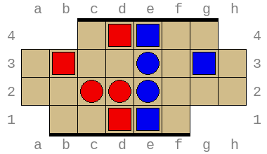

During a turn, a player can make 0, 1 or 2 *moves* and then must end with exactly
1 *push*. If a player cannot push, he or she loses the game immediately. A move
consists of taking a piece of the player's color (either a square or a round one)
and moving it to any free square that is reachable through a sequence of horizontal
and vertical moves. Finally, a push involves taking a square piece of the player's
color and moving it exactly 1 space up, down, left or right, pushing pieces that are
in the way in the same direction. At least 1 piece other piece must be pushed, though it
doesn't matter if that piece belongs to the player or his or her opponent.

Below is an example of the first turn for the red player, starting from the second
starting positon above. (The image below is an animated GIF. You may have to click the
play button to view it.)


Pieces cannot be pushed past the railing at the top and bottom of the board. However,
pieces can be pushed off the board on the left and right side (and off the top or bottom
of squares like *b3*  and *g2*). The first player who manages to push an opponent's
piece off the board, wins.

There is one final rule. After a player has performed their push move, a special piece
called an *anchor* is placed on the pushing piece. The opponent may not push that piece
during the next turn. This prevents obvious stalemates with players pushing the same
row of pieces back and forth.


## Notation of positions and moves

For convenience, let's define human-readable textual representation for
positions and moves. It's fairly easy to encode the board in text:

```
  abcdefgh
4   .OX..  4
3 ...oxY.. 3
2 ..Oox... 2
1  ..OX.   1
  abcdefgh
```

In this notation, `o` is a red circle (mover), `O` is a red square (pusher),
`x` is a blue circle (mover), `X` is a blue square (pusher), and `Y` is a blue
square with an anchor on top. Some tools also use `P` for a red square with
an anchor, but as will be explained below, we can usually assume without loss
of generality that the anchor is on a blue square.

If we want a more compact representation, we can remove the board coordinates:

```
   .OX..
 ...oxY..
 ..Oox...
  ..OX.
```

and put all characters on a single line:

`.OX.....oxY....Oox.....OX.`

Now, we've reduced the board to a single 26-character string.

For moves, we can use a chess-like notation. For example, `c2-d2` represents a
push to the right, and `d1-a2,d3-c3,c2-d2` represents two moves followed by a
final push. Note that the push is necessarily the last move in the sequence,
and it's also clear from the board, since moves always end in an empty square
while pushes must move a piece to an occupied square.


## Number of positions

Push Fight is an interesting game because of how constrained it is: the board
consists of only 26 squares, with 10 total pieces (5 for each player). Although
it's possible to push a piece off the board, this immediately ends the game,
so in any intermediate position all 10 pieces will be present.

If we ignore the anchor for a moment, that means all positions can be 
represented as permutations of a 26-character string that consists of
16 `.` (empty spaces), 2 `o`s, 3 `O`s, 2 `x`s, and 3 `X`s. The total number
of permutations is:

$26! / 16! / 3! / 2! / 3! / 2! = 133,855,722,000$

where x! represents the [factorial](https://en.wikipedia.org/wiki/Factorial)
of x. However, this doesn't account for the placing of the anchor, which can
be on any of the 6 square pieces or not in play at all. Seemingly, this would
multiple the number of positions by 7. However, if we're willing to treat the
first turn specially and we only want to be able to represent positions from
turn 2 and on, we can assume the anchor is in place.

Additionally, we can assume that the anchor is always on one of the second
player's squares, since the game board is symmetric, so we can always swap the
colors of the pieces. So without loss of generality, we will assume it's the
red player's turn to move, and the anchor is on one of the blue player's squares.
This means we will replace one of the `X`s with an `Y`, and all positions are
now some permutation of the string:

`................ooOOOxxXXY`

The total number of such permutations is:

$26! / 16! / 3! / 2! / 2! / 2! / 1! = 401,567,166,000$

This means every board position has an associated permutation index between
0 and 401,567,166,000 (exclusive). It turns out that, with some precomputation,
it's possible to efficiently convert between board positions and permutation
indices. Efficiently here means O(N) where N is the number of squares on the
board. See the logic in [perms.h](perms.h) and [perms.cc](perms.cc) for details.


### Unreachable permutations

Does every permutation represent a reachable position, in the sense that it can
be reached from a starting position by some sequence of valid moves (no matter
how improbable)? No, in fact, there are some permutations that are provably
unreachable, due to the placement of the anchor.

Recall that the anchor is placed on the opponent's piece that made the last
push move. That implies there must be a preceding position where this piece was
in a different place and pushed in a particular direction, moving at least on
other piece, and leaving an empty square behind. In the resulting position,
there must be some direction that has a piece next to the anchor, and an empty
piece on the opposite side. For example: a piece above the anchor and an empty
square below the anchor implies the anchored piece could have pushed up from the
square below.

If there is no direction such that there is a piece on one side and an empty
square on the other side, then the position is clearly unreachable. An example
is given below:

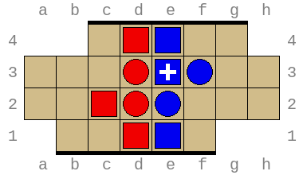

In the above position, the anchored piece on square *e3* could not have come
from anywhere, so while this is a valid permutation, it is not reachable through
normal play.

It follows from the above that the anchor can never be on some squares
(the eight corner squares: *a2*, *a3*, *b1*, *c4*, *f1*, *g4*, *h2*, and *h3*).

A brute-force search (see
[count-unreachable-output.txt](results/count-unreachable-output.txt)) shows that
of 401,567,166,000 total permutations, 172,416,263,040 (42.94%) are reachable
and 229,150,902,960 (57.06%) are unreachable.

Note that it's possible that there are other unreachable permutations that 
aren't identifiable as described above, but I'm not aware of any.

## Solving the game

To solve the game, we need, at a minimum, to decide for each position if it's
winning, losing, or tying for the next player. Ideally, we would also like to
record either a winning move or the number of turns left until a win/loss 
occurs, so we can enumerate the different options.

Note that a position is tying if neither player can force a win. In that case,
the game would go indefinitely (assuming optimal play from both sides). It's
not clear if tying positions exist, but it seems likely.

To compute results we need to consider the *successors* of a position: all
positions that are reachable in exactly 1 turn. In Push Fight, a turn consists
of up to two moves and one push, so the number of successors can be quite large
($5 × 4 / 2 × 16 × 16 × 12 = 30720$ is an upper bound, though the average is
somewhere around 5,000, with many practical positions below 2,000, since players
tend to fence off part of the board to limit their opponent's moves).

We can think of the game as a graph, with nodes representing board positions
and (directed) edges as possible moves. In other words, the edge *(p, q)* is
in the graph is *q* is a successor of *p*, and *q* is an intermediate
position. Positions reached after pushing a piece off the board are not
included in the graph.

The general algorithm for classifying nodes in the graph works as follows.

*Rule 1*: for a position *p*, if there is a way to win at the current turn,
we can mark the node as winning.

*Rule 2a*: otherwise, if there is any successor *q* that is marked losing, then
we can mark *p* as winning.

*Rule 2b*: otherwise, if all successors are marked winning, then we can mark *p*
as losing.

This leads to the following algorithm to solve the game:

 * Phase 0: loop over all positions, and apply rule 1. This marks some positions
   as winning, while leaving the rest undetermined.
 * Phase 1: loop over all positions that are yet undetermind, and apply rules 2a
   and 2b. This marks some undetermined positions as winning or losing, leaving the
   rest undetermined.
 * Phase 2..N: repeat the logic from phase 1 until no more changes occur.

This is a fixed-point iteration algorithm where we classify more and more positions
until we cannot find any more positions that can be classified by rules 2a and 2b.
At this point, we can stop and assume that all remaining indetermined positions are
actually ties.

We don't know in advance how many phases are necessary to compute the fixed point.

The phases have some interesting properties. In phase 0 we only find winning
positions. The means in phase 1, we can only identify newly-losing positions
because to identify a non-immediate winning position requires a losing successor
(rule 2a) which we haven't found yet. In phase 2, we can only find newly-winning
positions because identifying a losing position requires all successors are
winning for the opponent (rule 2b) and the previous phase didn't find any.

And so on: the phases alternate between finding only losing and winning
positions, with even phases finding winners and odd phases finding losers.

### Output files and sizes

Phase 0 classifies each possible value as winning or undetermined. Therefore we
can suffice with 1 bit per position, creating an output file of 401,567,166,000
bits, or 50.2 GB.

Phase 1..N need to produce a ternary value (winning, losing or undetermined).
We can encode 5 ternary values in a byte to obtain an efficient of 1.6 bits per
value, creating an output file of 80.3 GB.

Note that phase 1 is a little special in that it consumes the binary output from
phase 0, while phases 2 and on instead use a ternary input file that they also
use as an output file.

### Recovering strategies

The above data structures, once computed, can be used to classify an
arbitrary position (winning, losing or tied), though only after turn 1,
when the anchor is present. However, this information by itself isn't enough
to come up with a winning strategy.

For a losing position, it doesn't matter which moves we choose: by definition,
any successor is winning for the opponent and therefore losing for us.

For a tied position, we can simply choose any moves that lead to a successor
that is also tied: by definition, the opponent cannot win from that position
(and also by definition, a tied position cannot have successors that are losing
for the oppponent, or it would have been classified as winning).

For a winning position, we must choose moves that lead to a successor that
is marked losing for the opponent (and thus winning for us). But we cannot just
pick arbitrarily! If we do, and we're unlucky, we would end up in an infinite
loop.

So to recover the correct winning strategy, we need to keep a little more
information: the number of turns it takes to win/lose. That way, we can pick
the successor that leads to a win in the fewest possible moves.

More formally, if a position is losing because it has no successors, we mark
it as losing in 0 turns; otherwise, it is losing in (K + 1) turns where K is
the maximum value of a successor that is winning in K turns. Similarly, a
position with an immediate winning push is winning in 1 turn, and otherwise,
the position is winning in (K + 1) turns where K is the minimum value of a
successor that is losing in K turns.

This means we need a bit of additional data to store per position: the
number of turns it takes to achieve the outcome. How much space is needed
for this depends on the length of the longest path to a forced win, which is
equal to the number of times we need to execute the fixed point algorithm.

Note that we can save 1 bit by observing that in the above, losing positions
are always losing in an even number of turns (0, 2, 4, etc.) while winning
positions are always winning in odd number of turns (1, 2, 5, etc.) This makes
sense because there are only two ways for you to win: either you push an
opponent's piece off the board, or the opponent is unable to push on their turn;
either way, you made the last move, which means that if you are in a winning
position, you will always play one more turn than your opponent.

So how can we recover the number of turns remaining from the ternary output
files? Simple: positions won in 1 turn are identified in phase 0. The
positions lost in 2 turns are first identified in phase 1. The positions
won in 3 turns are identified in phase 2. And so on. So we simply need to
find, for each position, in which phase it was first classified. This gives
the number of turns left to play.

We can summarize this in a new data structure, but to do so efficiently, we
need to know exactly how many phases there are, since the number of phases
corresponds with the maximum number of turns leading to a win.


## Results

### Summary

| Phase |  Undetermined   |     Losses     |       Wins      |
|------:|----------------:|---------------:|----------------:|
|    -1 | 401,567,165,352 |            648 |               0 |
|     0 |  60,779,916,660 |            648 | 340,787,248,692 |
|     1 |  54,546,852,886 |  6,233,064,422 | 340,787,248,692 |
|     2 |  37,780,557,416 |  6,233,064,422 | 357,553,544,162 |
|     3 |  34,837,304,642 |  9,176,317,196 | 357,553,544,162 |
|     4 |  29,666,435,732 |  9,176,317,196 | 362,724,413,072 |
|     5 |  27,888,385,421 | 10,954,367,507 | 362,724,413,072 |
|     6 |  25,632,393,473 | 10,954,367,507 | 364,980,405,020 |


### Immediately losing positions (phase -1)

If a player cannot end their turn with a push, he or she will lose the game.

This occurs very rarely. Initially, it wasn't clear if there were any positions
where a player cannot make any valid push (after using the two moves optimally),
but it turns out there a few such cases. 648 to be exact (see
[solve-lost-output.txt](results/solve-lost-output.txt)), though most are
variations of two basic patterns:

Example 1: here, red has 1 square piece that can move freely, but any push would
push one of red's own pieces off the board.

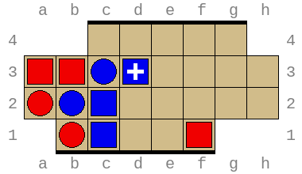

Example 2: here, all of red's pieces are locked in and no moves are possible
at all. The only possible push (h2-h3) would push red's own piece off the board.

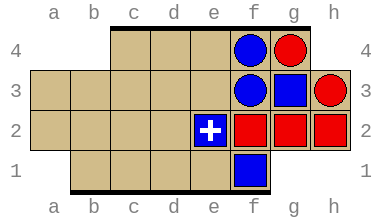

It's clear that these are artificial positions that wouldn't come up naturally
in a real game. The red player would never let their pieces get fenced in like
this, and even if he would, the blue player would be able to win earlier by
pushing a piece off the board, instead of waiting for red to lose on his turn.

### Immediately winning positions (phase 0)

The results from phase 0 ([r0-bitcount.txt](metadata/r0-bitcount.txt)) show that
of the 401,567,166,000 permutations, 340,787,248,692 (84.86%) can be won in
1 turn, and the remaining 60,779,917,308 (15.14%) are indeterminate. That means
only about a sixth of the positions remain to be processed in phase 1.

Most of these positions are really trivial, of course. Example:

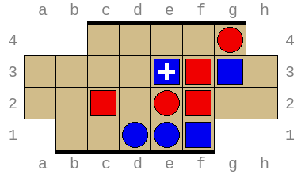

### Loss in 1 (phase 1)

The results from phase 1 ([r1-counts.txt](metadata/r1-counts)) show that
of the 401,567,166,000 permutations, 6,233,064,422 (1.55%) are lost in 1
move (or 2 turns if we count each player's turn separately). This is 10.26% of
the undecided positions after phase 1, with 54,546,852,886 (89.74%) positions
remaining undecided.

Due to how these results are computed, this includes the 648 immediately
lost positions, so very strictly speaking the count is only 6,233,063,774.

Most of these positions are still very simple. For example:

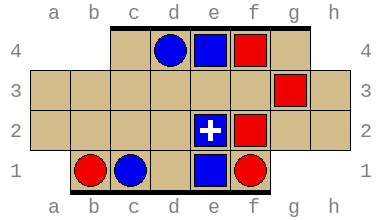

Here red (to move) can save the piece at *a1* or the piece at *f1*, but
not both, so blue will be able to win in the next turn.

### Win in 2 (phase 2)

For phase 2, I backpropagated the losses discovered in phase 1 using the
[backpropagate-losses](backpropagate-losses.cc) tool (i.e., for every losing
position, find the predecessors, and mark them winning, if they weren't before).
This approach was faster than the forward search, probably because to prove a
position is winning, we have to look at all successors and find one that is
losing for the opponent, but since losses are relatively rare (1.55% after
fase 1) most of these searches are exhaustive.

In this phase we discovered another 16,766,295,470 winning positions (see
[r2-wins-bitcount.txt](metadata/r2-wins-bitcount.txt)) which is 4.18% of the
total number of permutations, but 30.7% of the permutations that were still
undecided after phase 1.

Some of the winning positions have quite interesting moves. An example:

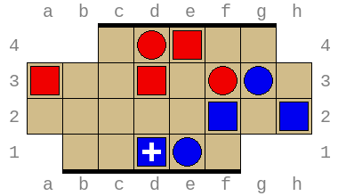

After e4-g4, a3-e3, d3-e3:

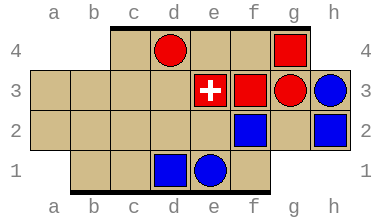

Blue can't possible save the piece at h3.

After this phase, 37,780,557,416 positions (69.3%) remain undecided and will
need to be re-evaluated in phase 3. Hopefully, this will be faster since to
prove a LOSS we have to check that all successors are won by the opponent.
If we find a tie, we can abort the search. Since there is still a large number
of ties remaining, we can probably abort a lot of searches early, and all the
searches that are exhaustive will discover an actual loss. This means either
the phase will be fast, or we will discover a lot of lost positions, both of
which are good.


### Loss in 2 (phase 3)

In phase 3, we discovered 2,943,252,774 positions that were lost in 2 moves
(or 4 turns). That's less than half of the number of losses discovered in
phase 1, but still 7.8% of the ties remaining after phase 2.

The losses found this way are starting to become interesting. Consider the
position below. It looks like red is in trouble with pieces on the edge at *b1*
and *f1*, but it seems that red should be able to salvage the situation with
something like f1-e1,b1-f3,f3-f2:


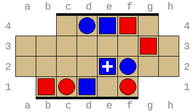

The situation afterwards looks much better, with none of red's pieces on the
edge, and blue's piece now in the danger zone on square *f1*! However, blue
can respond with *e4-d2,d4-b2,d1-c1*:


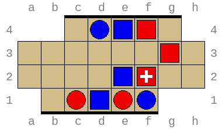

Blue has trapped red's round piece at *b1*. Note that the move *e4-d2* was
necessary to protect the piece at *f1*.


### Win in 3 (phase 4)

In phase 4, we discovered 5,170,866,758 positions (14.8% of the remaining
positions) that were won in 3 moves (or 5 turns). That's a lot less than in
phase 2 (even relatively speaking), which suggests we are swowly getting
closer to the fixed point.

There are 29,666,437,884 tied positions remaining (85.2% of the result of
after phase 3, or 78.5% after phase 2).


### Loss in 3 (phase 5)

In phase 5, we discovered 1,778,050,311 positions (6.0% of the remaining
positions) that are lost in 3 moves (or 6 turns).

### Win in 4 (phase 6)

In phase 6, we discovered 2,255,991,948 positions (8.1% of the remaining
positions) that are won in 4 moves (or 7 turns).

## Future work

 * Write about how to find optimal moves before turn 1.
 * List some stats from the final computation
 * Determining the best starting position
 * Finding a compact way to represent the optimal strategy
 * Are there any unreachable positions that I haven't accounted for already?
   If not, can I prove it? I could probably brute-force it with a breadth-first
   search starting from all initial positions, but it would be expensive.

## Puzzles

In the position below, red is to move. It looks like red is in trouble, with two
pieces about to be pushed off the board. However, there is a way for red to
survive at least one more turn! Can you tell how?

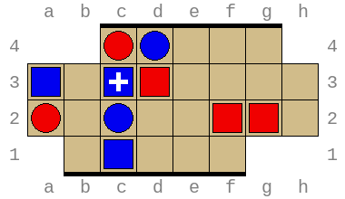
